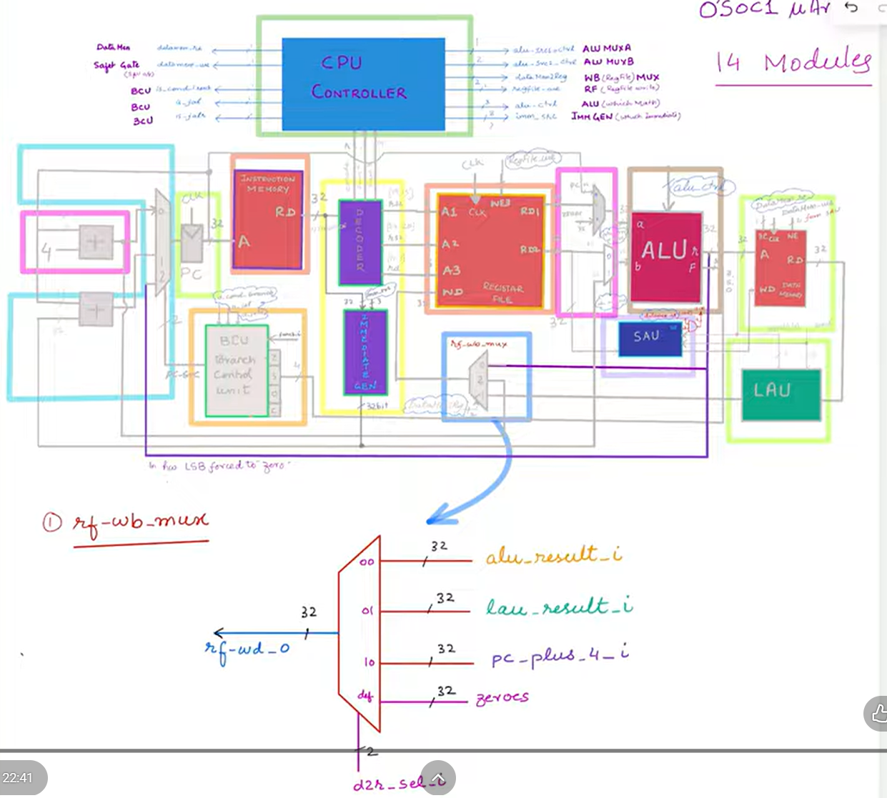

# s-core
my nth attempt in building a cpu

## Components used within this architecture.
- A register fiel
- An instruction memory
- some data memory
- a sign extender
- a bsic alue
- decoder/control unit 

