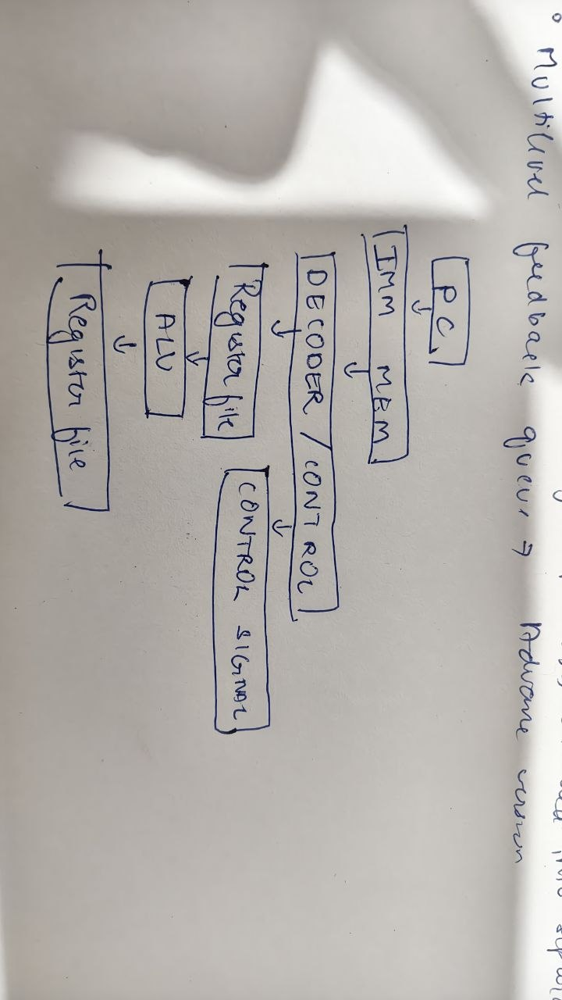

# s-core
my nth attempt in building a cpu

- Risc V - 32 bit, we are building the 32 bit so it has 32 register x0 to x31.

## Components used within this architecture.
- A register fiel
- An instruction memory
- some data memory
- a sign extender
- a bsic alue
- decoder/control unit 

---

# Memory.sv file
- We create a byte adressed memory file which can fetch data in one clock cycle ideally 
- The difference is what each memory address refers to.
    - Byte-addressed memory: each address points to 1 byte (8 bits).
    - Word-addressed memory: each address points to 1 word (e.g., 32 bits or 64 bits, depending on the architecture).

# Regfile.sv file
- Classical regfile -> with read and write operation primarily made for R type instruction.

# alu.sv 
- does arithmetic operation will be adding more and more types as the design evolves but for now very basic variant is given
- an input called alu_control is implemented its purpose is that when the alu encounters a operand which is not supported the answer is defaulted to zero.

# signext.sv
- sign extender
- The signext module converts a RISC-V immediate field into a full 32-bit signed value.
- Why is this needed?
- For an instruction like lw:
    - lw x5, 8(x1)
- the offset (8) is stored inside the instruction as a 12-bit immediate.
- The ALU, however, operates on 32-bit values, so we must:
    - Extract the immediate bits from the instruction.
    - Reconstruct them if they are scattered.
    - Extend them to 32 bits while preserving the sign.
